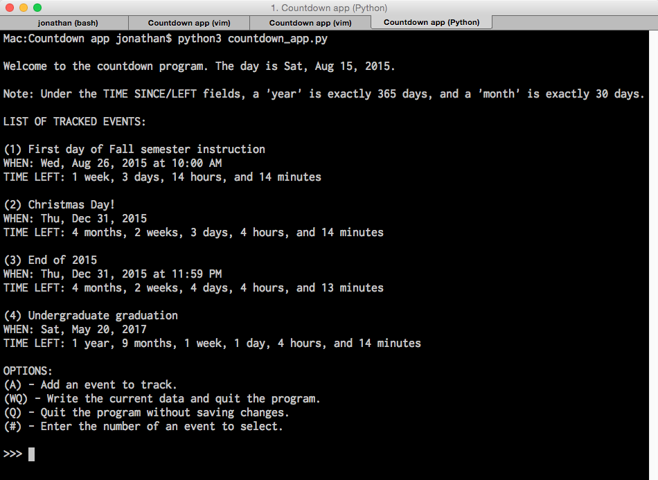

# Countdown tracker

Simple calendar-esque application for a user to track the precise "time until" or "time since" significant events. Uses RegEx to present timedeltas to the user in natural language strings.

 

